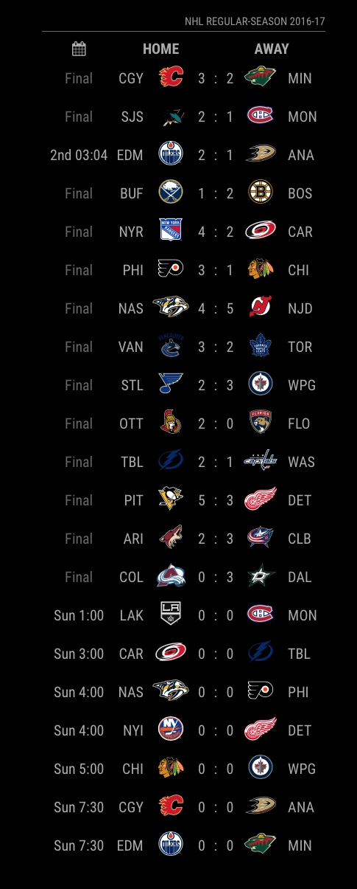

# MMM-NHL
National Hockey League Module for MagicMirror<sup>2</sup>

Started as a clone of https://github.com/fewieden/MMM-NFL with lots of modifications for NHL stats/schedule.

This module will give near-realtime updates during of the scores of currently running games.  It will show the previous days game, today's games and a set number of days that you specify (default is 1).

## Example



## Dependencies
  * An installation of [MagicMirror<sup>2</sup>](https://github.com/MichMich/MagicMirror)
  * npm
  * [request](https://www.npmjs.com/package/request)
  * [moment-timezone](https://www.npmjs.com/package/moment-timezone)

## Installation
 1. Clone this repo into `~/MagicMirror/modules` directory.
 2. Configure your `~/MagicMirror/config/config.js`:

    ```
    {
        module: 'MMM-NHL',
        position: 'top_right',
        config: {
            ...
        }
    }
    ```
 3. Run command `npm install` in `~/MagicMirror/modules/MMM-NHL` directory.

## Config Options
| **Option** | **Default** | **Description** |
| --- | --- | --- |
| `colored` | `false` | Remove black/white filter of logos. |
| `focus_on` | `false` | Display only matches with teams of this array e.g. 'NOT TESTED' |
| `format` | `'ddd h:mm'` | In which format the date should be displayed. [All Options](http://momentjs.com/docs/#/displaying/format/) |
| `reloadInterval` | `1800000` (30 mins) | How often should the data be fetched |
| `datesToLookAhead` | `1` (1 day) | How far in advance the schedule should be pulled |
